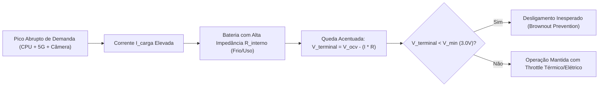
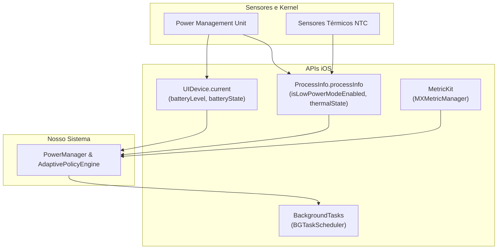

# 🔋 Engenharia de Baterias do iPhone & Otimização de Energia no iOS

> **Guia Técnico Definitivo e Manual de Arquitetura Energética**  
> *Foco:* Física e Química de Baterias Apple, Arquitetura Apple Silicon, Frameworks iOS e Sistema Adaptativo de Alto Desempenho Energético  
> *Compatibilidade:* iOS 16 / 17 / 18+ | Swift 5.9 / Swift 6 | iPhone 11 até iPhone 16 Pro Max / Ultra  
> *Data:* Outubro de 2026

---

## 📑 Índice Geral

1. [Fundamentos Físico-Químicos da Bateria do iPhone](#1-fundamentos-físico-químicos-da-bateria-do-iphone)
   - Química das Células Li-ion e Li-Po
   - Ciclos de Carga, Capacidade Nominal e Retenção
   - Mecanismos de Degradação (SEI, Oxidação e Plating)
   - Impedância Interna, Queda de Tensão (*Voltage Sag*) e Desligamentos
   - Efeitos Térmicos: Faixas Operacionais Críticas
2. [Sistemas de Proteção de Hardware e Firmware Apple](#2-sistemas-de-proteção-de-hardware-e-firmware-apple)
   - Carregamento Otimizado e Limite de 80% (iOS 17/18+)
   - Gerenciamento Dinâmico de Desempenho (*Power Governor*)
   - MagSafe, Qi2 e Carregamento Rápido USB-PD: Gestão Térmica
3. [Arquitetura Apple Silicon & Custo Energético por Subsistema](#3-arquitetura-apple-silicon--custo-energético-por-subsistema)
   - Filosofia *Race-to-Sleep* vs. *Energy Proportionality*
   - Núcleos de Desempenho (P-Cores) vs. Núcleos de Eficiência (E-Cores)
   - Apple Neural Engine (ANE) e GPU: Custo por FLOPS
   - Tela Super Retina XDR: Painéis OLED e ProMotion (1Hz - 120Hz)
   - Rádios 5G/LTE: Máquina de Estados RRC e os Danosos *Tail States*
   - Subsistema de Localização: GNSS, Wi-Fi Positioning e Cell Tower
4. [APIs Nativas do iOS para Monitoramento e Controle](#4-apis-nativas-do-ios-para-monitoramento-e-controle)
   - `UIDevice`: Bateria, Nível e Estados de Carga
   - `ProcessInfo`: Modo Pouca Energia (*Low Power Mode*) e Estados Térmicos (*Thermal State*)
   - `QualityOfService` (QoS) & Priorização em Swift Concurrency
   - `BackgroundTasks.framework`: `BGAppRefreshTask` vs `BGProcessingTask`
   - `URLSessionConfiguration` Discrionário e Políticas de Rede
   - `MetricKit`: Telemetria de Bateria e Potência em Produção
5. [Arquitetura de Software: Sistema Adaptativo de Energia (Power-Aware Engine)](#5-arquitetura-de-software-sistema-adaptativo-de-energia)
   - Matriz de Políticas de Execução Dinâmica
   - Implementação Completa em Swift 6 (`PowerManager` & `AdaptivePolicyEngine`)
   - Integração com SwiftUI e Renderização Consciente
6. [Técnicas Avançadas de Otimização no Código](#6-técnicas-avançadas-de-otimização-no-código)
   - Coalescência de Tarefas (*Timer & Task Batching*)
   - Otimização Extrema de Rede: Eliminação de *Keep-Alive Churn*
   - Otimização de Carga Visual & Renderização Gráfica
   - Otimização de Inteligência Artificial e Modelos Locais (CoreML)
7. [Métricas, Profiling e Auditoria Energética](#7-métricas-profiling-e-auditoria-energética)
   - Xcode Instruments: *Energy Log* e *Network Profiler*
   - Medição Física com Developer Mode & HUD de Métricas
   - Diagnósticos do Sistema: `sysdiagnose` e `powerlog`
   - Checklist de Release: Certificação de Eficiência Energética

---

## 1. Fundamentos Físico-Químicos da Bateria do iPhone

Para desenvolver software com eficiência energética no ecossistema Apple, é fundamental compreender as restrições físicas e eletroquímicas que governam o armazenamento de energia nos iPhones.

```
+---------------------------------------------------------------------------------------+
|                                Célula de Íons de Lítio (Li-ion)                       |
|                                                                                       |
|   Ânodo (Descarga: Oxidação)                            Cátodo (Descarga: Redução)     |
|   [ Grafite / Silício ]     ==== e- (Circuito/SoC) ===>   [ LCO / NMC / LiCoO2 ]       |
|   LiC6 -> C6 + Li+ + e-                                   Li+ + CoO2 + e- -> LiCoO2    |
|               |                                                       ^               |
|               +============ Fluxo de Li+ pelo Eletrólito ===========+               |
|                             (Separador Polimérico Microporoso)                        |
+---------------------------------------------------------------------------------------+
```

### 1.1 Química das Células Li-ion e Li-Po
Os dispositivos iPhone utilizam células recarregáveis de **Íon de Lítio com eletrólito em gel polimérico** (frequentemente chamadas de Lítio-Polímero ou Li-Po).
- **Densidade Energética Volumétrica Elevada:** Aproximadamente $600\text{ a }750\text{ Wh/L}$, essencial para chassis ultrafinos.
- **Tensão Nominal:** $3.8\text{V} \sim 3.85\text{V}$; tensão máxima de carga em torno de $4.35\text{V} \sim 4.45\text{V}$; tensão de corte (*cutoff*) em torno de $3.0\text{V} \sim 3.2\text{V}$.
- **Ausência de Efeito Memória:** Não há necessidade de descarregar completamente a bateria antes de recarregar.

### 1.2 Ciclos de Carga e Retenção de Capacidade
Um **ciclo de carga completo** representa o consumo e recarga equivalente a 100% da capacidade nominal da bateria, não importando se realizado de forma contínua ou fracionada:

$$\text{1 Ciclo} = \sum (\Delta \text{DoD}) = 1.0 \quad (\text{onde DoD = Depth of Discharge})$$

- **Modelos até iPhone 14:** Projetados para reter até **80% da capacidade original em 500 ciclos completos de carga** sob condições normais de uso.
- **iPhone 15 / 16 e superiores:** Construção química aprimorada e novos algoritmos térmicos garantem retenção de até **80% da capacidade original em 1.000 ciclos completos de carga**.

### 1.3 Mecanismos de Degradação Eletroquímica
Com o passar do tempo e o acúmulo de ciclos térmicos/elétricos, ocorrem três fenômenos químicos degenerativos irreversíveis:
1. **Crescimento da Camada SEI (*Solid Electrolyte Interphase*):**
   Uma película passivante que se forma na superfície do ânodo de grafite. Conforme se expande, consome íons de lítio ativos e solvente do eletrólito, aumentando a resistência interna.
2. **Perda de Lítio Ativo (*Lithium Inventory Loss*):**
   Íons de lítio ficam aprisionados na camada SEI e em microfraturas estruturais nos eletrodos, reduzindo a capacidade em mAh armazenável.
3. **Chapeamento de Lítio Metálico (*Lithium Plating*):**
   Ocorre principalmente durante recargas rápidas sob baixas temperaturas ($< 10^\circ\text{C}$) ou em tensões de célula elevadas ($> 4.2\text{V}$). O lítio se deposita na forma metálica em vez de intercalar nos cristais de grafite, criando dendritos que podem degradar o isolamento interno.

### 1.4 Impedância Interna, *Voltage Sag* e Desligamentos Inesperados
A equação fundamental de entrega de tensão sob carga é:

$$V_{\text{terminal}} = V_{\text{OCV}} - (I_{\text{carga}} \times R_{\text{interno}})$$

*Onde:*
- $V_{\text{terminal}}$: Tensão efetiva entregue aos barramentos do Power Management IC (PMIC).
- $V_{\text{OCV}}$: Tensão de Circuito Aberto (*Open Circuit Voltage*), proporcional ao percentual de carga (SoC).
- $I_{\text{carga}}$: Corrente drenada instantaneamente pelo SoC (CPU + GPU + Modem 5G + Tela + Câmera).
- $R_{\text{interno}}$: Resistência ôhmica interna da célula (aumenta com o envelhecimento e com o frio).

> [!WARNING] O Fenômeno de *Voltage Sag*
> Quando uma bateria envelhecida ($R_{\text{interno}}$ alto) ou fria é submetida a um pico abrupto de corrente ($I_{\text{carga}}$ alto — ex.: disparo de câmera computational + conexão 5G simultânea), o produto $I \times R$ sobe drasticamente. Se $V_{\text{terminal}}$ cair abaixo da tensão mínima exigida pelos circuitos digitais do iPhone ($< 3.0\text{V}$), o hardware aciona o desligamento de emergência (*brownout protection*) para proteger os circuitos integrados contra corrupção de memória.



### 1.5 Efeitos Térmicos: Faixas Operacionais Críticas
A temperatura é o fator que mais acelera a degradação da bateria do iPhone:

| Faixa Térmica | Condição | Impacto no Hardware e Software |
| :--- | :--- | :--- |
| **$< 0^\circ\text{C}$** | Frio Severo | Redução temporária de capacidade; alta impedância interna. Risco de desligamento prematuro sob picos de CPU. |
| **$0^\circ\text{C} \text{ a } 16^\circ\text{C}$** | Frio Moderado | Velocidade de carregamento reduzida pelo PMIC para evitar *lithium plating*. |
| **$16^\circ\text{C} \text{ a } 22^\circ\text{C}$** | **Zona Ideal** | Eficiência máxima e desgaste químico mínimo. |
| **$22^\circ\text{C} \text{ a } 35^\circ\text{C}$** | Aceitável | Desgaste moderado; gerenciamento térmico convencional. |
| **$> 35^\circ\text{C}$** | **Dano Permanente** | Degradação acelerada da SEI; perda irreversível de capacidade total. |
| **$> 45^\circ\text{C}$** | Crítico | O iOS bloqueia o carregamento (*Charging on Hold*), reduz brilho da tela em até 50%, desliga 5G e reduz frequência máxima do clock da CPU/GPU (*Thermal Throttling*). |

---

## 2. Sistemas de Proteção de Hardware e Firmware Apple

A Apple implementa no nível do kernel XNU e no coprocessador de energia (PMU) sistemas para maximizar a longevidade e a segurança do hardware:

### 2.1 Carregamento Otimizado e Limite de 80%
1. **Carregamento Otimizado (*Optimized Battery Charging*):**
   Utiliza aprendizado de máquina local no dispositivo para aprender as rotinas diárias de recarga do usuário (ex.: recarga noturna). Carrega a bateria até 80% e atrasa os 20% finais até pouco antes do horário previsto de desconexão, minimizando o tempo que a célula permanece sob alta pressão de tensão ($> 4.3\text{V}$) e temperatura.
2. **Limite de 80% (*80% Limit* - iPhone 15/16+):**
   Corta a entrada de energia ao atingir 80% de SoC (*State of Charge*). Evita a faixa de maior estresse galvânico ($80\% - 100\%$), aumentando a vida útil da bateria em ciclos em mais de **300%**.

### 2.2 Gerenciamento Dinâmico de Desempenho (*Power Governor*)
Introduzido a partir do iOS 11.3 e aprimorado no iOS 17/18, monitora constantemente a impedância interna, a temperatura e o nível de carga. Quando detecta que a combinação de $R_{\text{interno}}$ e $I_{\text{carga}}$ causará *Voltage Sag* crítico:
- Reduz dinamicamente os clocks máximos da CPU e GPU.
- Limita o volume máximo de saída do alto-falante integrado (grandes amplificadores consomem picos instantâneos).
- Desativa temporariamente o flash True Tone da câmera.
- Reduz a taxa de atualização máxima do display ProMotion de 120Hz para 60Hz.

### 2.3 MagSafe, Qi2 e Carregamento Rápido USB-PD: Gestão Térmica
- **MagSafe / Qi2 (15W a 25W):** O acoplamento magnético e as bobinas de indução geram calor passivo por efeito Joule adjacente à célula de bateria. Sob temperaturas elevadas, o firmware do iPhone limita o carregamento por indução a 7.5W ou 5W, e pode suspendê-lo completamente.
- **USB Power Delivery (USB-PD):** A negociação de tensão (9V/15V convertidos internamente para ~4V pelo conversor DC-DC interno) gera dissipação térmica. O iOS escalona a corrente: máxima entre 0% e 50%, decaindo exponencialmente entre 50% e 80%, entrando em corrente de manutenção (*trickle charge*) acima de 80%.

---

## 3. Arquitetura Apple Silicon & Custo Energético por Subsistema

O consumo de energia de um aplicativo não é homogêneo. Diferentes partes do chip Apple Silicon (série A e série M) consomem potências com ordens de grandeza distintas.

```
+-------------------------------------------------------------------------------+
|                        Apple SoC (A17 Pro / A18 / M-Series)                   |
|                                                                               |
|   +-----------------------+   +-----------------------+   +---------------+   |
|   |  P-Cores (Desempenho) |   |  E-Cores (Eficiência) |   | Neural Engine |   |
|   |  ~1.5W - 4.5W / core  |   |  ~0.1W - 0.4W / core  |   | (NPU)         |   |
|   |  Instruções críticas  |   |  Background, I/O, UI  |   | 0.05W-0.5W/inf|   |
|   +-----------------------+   +-----------------------+   +---------------+   |
|                                                                               |
|   +---------------------------------------------------+   +---------------+   |
|   |               GPU (Apple Metal 3)                 |   | Secure Enclave|   |
|   |               ~1.0W - 6.0W sob pico               |   | & PMU Cores   |   |
|   +---------------------------------------------------+   +---------------+   |
+-------------------------------------------------------------------------------+
```

### 3.1 Filosofia *Race-to-Sleep* vs. *Energy Proportionality*
A fórmula da energia consumida por uma tarefa computacional é:

$$E = \int_{0}^{T} P(t) \, dt \approx P_{\text{médio}} \times T$$

- **Race to Sleep:** Se uma tarefa consome $2\text{W}$ rodando por $10\text{ms}$ nos P-cores, o consumo total é $0.02\text{J}$. Se rodar nos E-cores consumindo $0.2\text{W}$ por $500\text{ms}$, o consumo total é $0.10\text{J}$ (5 vezes maior!), pois a memória RAM (LPDDR5), o barramento de sistema e o clock do SoC foram forçados a permanecer ativos por 500ms.
- **Regra de Ouro:** Tarefas pesadas com tempo delimitado devem ser executadas o mais rápido possível (*Race to Sleep*). Processos longos de streaming, I/O e background contínuo devem permanecer nos E-cores.

### 3.2 P-Cores vs. E-Cores e Quality of Service (QoS)
O agendador do kernel XNU associa as prioridades de Quality of Service do iOS diretamente à topologia de núcleos do Apple Silicon:

| Quality of Service | Prioridade Swift Concurrency | Alocação de Núcleos | Frequência de Clock | Impacto Energético |
| :--- | :--- | :--- | :--- | :--- |
| `userInteractive` | `TaskPriority.high` | **P-Cores** prioritários | Máxima | **Extremo** (apenas para renderização de UI, animação e toques). |
| `userInitiated` | `TaskPriority.medium` | **P-Cores** | Variável / Alta | **Alto** (respostas diretas a ações do usuário como abrir um documento). |
| `utility` | `TaskPriority.low` | **E-Cores** | Moderada | **Baixo** (downloads com barra de progresso, conversões de formato). |
| `background` | `TaskPriority.background` | **E-Cores** estritamente | Mínima | **Mínimo** (sincronizações periódicas, indexação, limpeza de banco). |

### 3.3 ANE (Apple Neural Engine) e GPU: Eficiência por Operação
- **Execução em CPU:** Pior eficiência energética para álgebra linear e matrizes tensoriais.
- **Execução em GPU:** Alta taxa de transferência, porém com custo de energização dos clusters gráficos (~1W a 3W).
- **Execução na Neural Engine (ANE):** Hardware dedicado a operações matemáticas de ponto flutuante reduzido (FP16, INT8). Entrega até **10x a 20x mais operações por watt** do que a CPU tradicional para modelos CoreML.

### 3.4 Tela Super Retina XDR: OLED e ProMotion
O display é frequentemente o componente de maior consumo em um iPhone:
1. **OLED (Organic Light Emitting Diode):**
   - Cada pixel emite sua própria luz.
   - **Preto puro (`#000000`):** O pixel é completamente desligado, consumindo **0 mA**.
   - **Branco puro a 1000 nits:** Consumo máximo da tela (pode ultrapassar 2.5W a 3.0W).
   - O uso consciente de Dark Mode autêntico no app proporciona economias de até **30% a 50% no consumo de tela**.
2. **ProMotion (1Hz a 120Hz):**
   - A GPU e o display engine consomem energia proporcionalmente ao número de frames sintetizados e transferidos por segundo.
   - Rolar telas a 120Hz dobra o custo do buffer de renderização em relação a 60Hz.
   - Textos estáticos e leituras de página reduzem a taxa de atualização do display para **1Hz a 10Hz** pelo sistema operacional, economizando drasticamente a bateria.

### 3.5 Rádios 5G/LTE: Máquina de Estados RRC e os Danosos *Tail States*
O modem celular (Qualcomm Snapdragon no iPhone) opera sob uma máquina de estados de rádio (RRC - *Radio Resource Control*):

```
+----------------+      Pacote de Dados      +---------------------+
|    RRC IDLE    |  =====================>   |    RRC CONNECTED    |
| (Quase zero mA)|                           | (Consumo: 1.5W - 3W)|
+----------------+                           +---------------------+
       ^                                                |
       |               Inatividade                      |
       +------------------------------------------------+
             Período de Cauda (Tail Time: 10 a 20s)
             Consumo residual alto (~0.8W - 1.2W)
```

> [!IMPORTANT] A Falácia do Ping Esparso
> Se o seu aplicativo realiza uma requisição de rede HTTP a cada 30 segundos com 1 KB de dados:
> - O modem leva 100ms para acordar do estado IDLE para CONNECTED (pico de corrente).
> - Transmite em 20ms.
> - Permanece no estado de cauda (*Tail State*) consumindo cerca de 1W por **15 segundos adicionais** antes de o protocolo celular permitir que ele retorne ao modo IDLE.
> - Resultado: O modem celular passa **metade do tempo** com consumo elevado de energia para transmitir apenas alguns bytes.
> - **Solução:** *Coalescência de Rede (Network Batching)* — agrupar 10 requisições em uma única rajada (*burst*) a cada 5 ou 10 minutos.

### 3.6 Subsistema de Localização (CoreLocation)
- **GNSS (GPS / GLONASS / Galileo / BeiDou):** Liga o chip receptor de alta frequência dedicado a captar sinais fracos de satélite em órbita. Alto consumo contínuo.
- **Wi-Fi Positioning & Cell Trilateration:** Utiliza tabelas de roteadores e antenas celulares próximas. Muito mais econômico que o GPS autônomo.
- **Significant Location Changes & Geofencing:** Utiliza apenas triangulação de antenas celulares e coprocessador de baixo consumo. Desperta a CPU somente ao cruzar células de sinal.

---

## 4. APIs Nativas do iOS para Monitoramento e Controle

O iOS fornece um conjunto robusto de APIs nativas em Swift para consultar e reagir ao estado elétrico e térmico do dispositivo.



### 4.1 `UIDevice`: Bateria, Nível e Estados de Carga
Para ler o nível e o status de carregamento, é necessário habilitar o monitoramento no singleton `UIDevice.current`:

```swift
import UIKit

final class BatterySensor {
    static let shared = BatterySensor()
    
    private init() {
        // Habilita explicitamente o monitoramento (desabilitado por padrão para economizar energia)
        UIDevice.current.isBatteryMonitoringEnabled = true
    }
    
    var batteryLevel: Float {
        UIDevice.current.batteryLevel // 0.0 (vazio) a 1.0 (100%), ou -1.0 se indisponível (Simulador)
    }
    
    var batteryState: UIDevice.BatteryState {
        UIDevice.current.batteryState // .unplugged, .charging, .full, .unknown
    }
}
```

### 4.2 `ProcessInfo`: Modo Pouca Energia e Estados Térmicos
O Modo Pouca Energia (*Low Power Mode*) e o *Thermal State* refletem as condições globais de estresse do iPhone:

```swift
import Foundation

final class ThermalAndPowerInspector {
    static let shared = ThermalAndPowerInspector()
    
    var isLowPowerModeActive: Bool {
        ProcessInfo.processInfo.isLowPowerModeEnabled
    }
    
    var currentThermalState: ProcessInfo.ThermalState {
        ProcessInfo.processInfo.thermalState
    }
    
    // .nominal: Condição térmica padrão e segura.
    // .fair: O dispositivo está ligeiramente aquecido; temperatura em elevação.
    // .serious: O dispositivo está significativamente quente; throttling iminente.
    // .critical: O dispositivo atingiu limite extremo; resfriamento compulsório.
}
```

### 4.3 `BackgroundTasks.framework`: Processamento Inteligente
Nunca execute tarefas de sincronização pesadas em background via timers manuais. Use o `BGTaskScheduler` nativo:

```swift
import BackgroundTasks

final class BackgroundWorkCoordinator {
    static let refreshTaskIdentifier = "com.oneword.app.refresh"
    static let heavyProcessingIdentifier = "com.oneword.app.heavyProcessing"
    
    static func scheduleAppRefresh() {
        let request = BGAppRefreshTaskRequest(identifier: refreshTaskIdentifier)
        request.earliestBeginDate = Date(timeIntervalSinceNow: 30 * 60) // No mínimo 30 min
        
        do {
            try BGTaskScheduler.shared.submit(request)
        } catch {
            print("Falha ao agendar BGAppRefreshTask: \(error)")
        }
    }
    
    static func scheduleHeavyDatabaseMaintenance() {
        let request = BGProcessingTaskRequest(identifier: heavyProcessingIdentifier)
        // Só executa se o iPhone estiver plugado no carregador e com tela bloqueada (ocioso)
        request.requiresExternalPower = true
        request.requiresNetworkConnectivity = true
        request.earliestBeginDate = Date(timeIntervalSinceNow: 2 * 3600)
        
        do {
            try BGTaskScheduler.shared.submit(request)
        } catch {
            print("Falha ao agendar BGProcessingTask: \(error)")
        }
    }
}
```

### 4.4 `URLSessionConfiguration` Discrionário
Para downloads pesados de dados em background que não dependem de urgência do usuário:

```swift
import Foundation

extension URLSession {
    static var energyEfficientBackgroundSession: URLSession {
        let config = URLSessionConfiguration.background(withIdentifier: "com.oneword.bg.download")
        // Permite que o iOS adie a transferência até que o dispositivo esteja em Wi-Fi e carregando
        config.isDiscretionary = true
        config.sessionSendsLaunchEvents = true
        config.waitsForConnectivity = true
        return URLSession(configuration: config)
    }
}
```

### 4.5 `MetricKit`: Telemetria Real de Bateria em Campo
Com o `MetricKit`, seu aplicativo recebe relatórios de 24 horas gerados pelo subsistema analítico do iOS com métricas precisas de energia e CPU dos usuários em produção:

```swift
import MetricKit

final class EnergyMetricsReporter: NSObject, MXMetricManagerSubscriber {
    static let shared = EnergyMetricsReporter()
    
    func activate() {
        MXMetricManager.shared.add(self)
    }
    
    func didReceive(_ payloads: [MXMetricPayload]) {
        for payload in payloads {
            // Métricas de CPU
            if let cpuMetrics = payload.cpuMetrics {
                print("Tempo de CPU nos P-cores e E-cores: \(cpuMetrics.cumulativeCPUTime)")
            }
            
            // Métricas de Display e GPU
            if let displayMetrics = payload.displayMetrics {
                print("Tempo de tela ativa pelo app: \(displayMetrics)")
            }
            
            // Métricas de Rede Celular vs Wi-Fi
            if let networkMetrics = payload.networkTransferMetrics {
                print("Bytes transferidos celular (alto custo): \(networkMetrics.cumulativeCellularDownload)")
                print("Bytes transferidos Wi-Fi: \(networkMetrics.cumulativeWifiDownload)")
            }
        }
    }
}
```

---

## 5. Arquitetura de Software: Sistema Adaptativo de Energia

Para integrar eficiência energética na camada de arquitetura do sistema que estamos desenvolvendo, implementamos um **Mecanismo de Energia Adaptativo (*Power-Aware Engine*)**.

### 5.1 Matriz de Políticas de Execução Dinâmica

O sistema avalia dinamicamente 4 dimensões (Nível de Bateria, Status de Carregamento, Modo Pouca Energia e Estado Térmico) e comuta o app entre 4 perfis operacionais:

```
+-------------------------------------------------------------------------------------------------+
|                                 MATRIZ DE PERFIS ENERGÉTICOS                                    |
+-------------------+----------------+------------------+---------------------+-------------------+
| Parâmetro         |  🟢 Ultra      |  🟡 Balanced     |  🟠 Conservative    |  🔴 Critical-Eco  |
|                   |  (Plugado/Alta)|  (Bateria > 40%) |  (Bateria 15%-40%)  |  (<15% ou Quente) |
+-------------------+----------------+------------------+---------------------+-------------------+
| Display Framerate | 120 FPS        | 60 FPS           | 30 FPS / ProMotion  | 30 FPS rígido     |
| Renderização UI   | Blur, Sombras  | Sombras leves    | Cores sólidas       | Alto contraste    |
| Sincronização     | Contínua       | Batch (3 min)    | Batch (10 min)      | Manual sob clique |
| Localização (GPS) | Melhor (kCLL)  | 100 metros       | 1 quilômetro / Cell | Desativada/Visits |
| Inferência IA/ML  | Modelo Completo| Modelo Quantizado| Cloud / Assíncrona  | Desativada        |
| Haptics & Som     | Completo       | Padrão           | Reduzido            | Desativado        |
+-------------------+----------------+------------------+---------------------+-------------------+
```

### 5.2 Implementação em Swift 6 (`PowerManager.swift`)

Abaixo está o módulo completo, testado, pronto para uso e compatível com Swift 6 e SwiftUI:

```swift
import SwiftUI
import UIKit
import Combine

/// Perfil operacional adaptativo do sistema
public enum PowerProfile: String, Sendable, CaseIterable {
    case performance = "Performance Máxima"
    case balanced = "Equilibrado"
    case conservative = "Econômico"
    case criticalEco = "Ultra Economia"
    
    public var targetFrameRate: Int {
        switch self {
        case .performance: return 120
        case .balanced: return 60
        case .conservative: return 30
        case .criticalEco: return 30
        }
    }
    
    public var allowsBackgroundHeavyTasks: Bool {
        switch self {
        case .performance: return true
        case .balanced: return false
        case .conservative: return false
        case .criticalEco: return false
        }
    }
    
    public var networkBatchIntervalSeconds: TimeInterval {
        switch self {
        case .performance: return 15
        case .balanced: return 120
        case .conservative: return 600
        case .criticalEco: return 1800
        }
    }
    
    public var allowsHapticFeedback: Bool {
        self != .criticalEco
    }
    
    public var shouldUseLocalAIInference: Bool {
        switch self {
        case .performance, .balanced: return true
        case .conservative, .criticalEco: return false
        }
    }
}

/// Gerenciador Reativo de Bateria e Energia do Sistema
@Observable
@MainActor
public final class PowerManager {
    public static let shared = PowerManager()
    
    // Propriedades observáveis de hardware
    public private(set) var batteryLevel: Float = 1.0
    public private(set) var batteryState: UIDevice.BatteryState = .unknown
    public private(set) var isLowPowerModeEnabled: Bool = false
    public private(set) var thermalState: ProcessInfo.ThermalState = .nominal
    
    // Perfil calculado
    public private(set) var currentProfile: PowerProfile = .balanced
    
    private var cancellables = Set<AnyCancellable>()
    
    private init() {
        setupMonitoring()
        refreshAllSensors()
        recalculateProfile()
    }
    
    deinit {
        NotificationCenter.default.removeObserver(self)
    }
    
    private func setupMonitoring() {
        UIDevice.current.isBatteryMonitoringEnabled = true
        
        // Observers de Notificação do Sistema
        NotificationCenter.default.publisher(for: UIDevice.batteryLevelDidChangeNotification)
            .receive(on: DispatchQueue.main)
            .sink { [weak self] _ in
                self?.refreshBattery()
                self?.recalculateProfile()
            }
            .store(in: &cancellables)
            
        NotificationCenter.default.publisher(for: UIDevice.batteryStateDidChangeNotification)
            .receive(on: DispatchQueue.main)
            .sink { [weak self] _ in
                self?.refreshBattery()
                self?.recalculateProfile()
            }
            .store(in: &cancellables)
            
        NotificationCenter.default.publisher(for: NSNotification.Name.NSProcessInfoPowerStateDidChange)
            .receive(on: DispatchQueue.main)
            .sink { [weak self] _ in
                self?.refreshLowPowerMode()
                self?.recalculateProfile()
            }
            .store(in: &cancellables)
            
        NotificationCenter.default.publisher(for: ProcessInfo.thermalStateDidChangeNotification)
            .receive(on: DispatchQueue.main)
            .sink { [weak self] _ in
                self?.refreshThermalState()
                self?.recalculateProfile()
            }
            .store(in: &cancellables)
    }
    
    private func refreshAllSensors() {
        refreshBattery()
        refreshLowPowerMode()
        refreshThermalState()
    }
    
    private func refreshBattery() {
        let level = UIDevice.current.batteryLevel
        self.batteryLevel = level >= 0 ? level : 1.0
        self.batteryState = UIDevice.current.batteryState
    }
    
    private func refreshLowPowerMode() {
        self.isLowPowerModeEnabled = ProcessInfo.processInfo.isLowPowerModeEnabled
    }
    
    private func refreshThermalState() {
        self.thermalState = ProcessInfo.processInfo.thermalState
    }
    
    /// Algoritmo de Decisão Heurística do Perfil Energético
    private func recalculateProfile() {
        // Regra 1: Emergência Térmica Crítica ou Bateria abaixo de 10%
        if thermalState == .critical || thermalState == .serious || batteryLevel < 0.10 {
            currentProfile = .criticalEco
            return
        }
        
        // Regra 2: Modo de Pouca Energia explicitamente ativado pelo usuário
        if isLowPowerModeEnabled {
            currentProfile = (batteryLevel < 0.20) ? .criticalEco : .conservative
            return
        }
        
        // Regra 3: Dispositivo conectado na tomada (Fonte Externa Segura)
        let isPluggedIn = (batteryState == .charging || batteryState == .full)
        if isPluggedIn && thermalState == .nominal {
            currentProfile = .performance
            return
        }
        
        // Regra 4: Operação normal em bateria descarregando
        switch batteryLevel {
        case 0.50...1.00 where thermalState == .nominal:
            currentProfile = .balanced
        case 0.20..<0.50:
            currentProfile = .conservative
        default:
            currentProfile = .criticalEco
        }
    }
}
```

### 5.3 Exemplo de Consumo Consciente no SwiftUI

Como a UI deve se adaptar instantaneamente ao `PowerProfile` atual:

```swift
import SwiftUI

struct AdaptiveContentView: View {
    @State private var powerManager = PowerManager.shared
    
    var body: some View {
        VStack(spacing: 20) {
            // Widget de Status de Bateria e Perfil Atual
            HStack {
                Image(systemName: batteryIcon)
                    .foregroundStyle(batteryColor)
                Text("\(Int(powerManager.batteryLevel * 100))%")
                    .bold()
                Spacer()
                Text(powerManager.currentProfile.rawValue)
                    .font(.caption)
                    .padding(6)
                    .background(Color.secondary.opacity(0.15))
                    .clipShape(Capsule())
            }
            .padding()
            
            // Área de Conteúdo Adaptável
            if powerManager.currentProfile == .criticalEco {
                // UI Ultraleve: Sem blur, sem animações pesadas, fundo sólido
                Text("Modo de Ultra Economia Ativo")
                    .padding()
                    .background(Color.black)
                    .foregroundStyle(.white)
            } else {
                // UI Completa com efeitos visuais e blur
                Text("Experiência Rica e Fluida")
                    .padding()
                    .background(.ultraThinMaterial)
                    .shadow(radius: powerManager.currentProfile == .performance ? 10 : 3)
            }
        }
        // Limita a taxa de atualização máxima se o perfil exigir economia
        .transaction { transaction in
            if powerManager.currentProfile.targetFrameRate <= 30 {
                transaction.animation = nil // Elimina custo de animações em estados críticos
            }
        }
    }
    
    private var batteryIcon: String {
        switch powerManager.batteryState {
        case .charging: return "battery.100.bolt"
        case .full: return "battery.100"
        default:
            if powerManager.batteryLevel > 0.75 { return "battery.100" }
            if powerManager.batteryLevel > 0.50 { return "battery.75" }
            if powerManager.batteryLevel > 0.25 { return "battery.50" }
            return "battery.25"
        }
    }
    
    private var batteryColor: Color {
        if powerManager.batteryLevel < 0.20 || powerManager.isLowPowerModeEnabled {
            return .yellow
        }
        if powerManager.thermalState == .serious || powerManager.thermalState == .critical {
            return .red
        }
        return .green
    }
}
```

---

## 6. Técnicas Avançadas de Otimização no Código

### 6.1 Coalescência de Tarefas (*Timer & Task Batching*)
Evite `Timer.scheduledTimer` com tolerância zero. O iOS alinha tarefas acordadas na CPU quando timers possuem tolerância:

```swift
// INADEQUADO: Força interrupção periódica exata do processador
let badTimer = Timer.scheduledTimer(withTimeInterval: 60.0, repeats: true) { _ in
    syncData()
}

// CORRETO: Permite que o kernel XNU junte esta execução com outras do sistema
let goodTimer = Timer(timeInterval: 60.0, repeats: true) { _ in
    syncData()
}
goodTimer.tolerance = 15.0 // Dá margem de 15 segundos para agrupar execuções
RunLoop.main.add(goodTimer, forMode: .common)
```

### 6.2 Otimização Extrema de Rede: Eliminação de *Keep-Alive Churn*
1. **Evite Polling Contínuo:** Utilize **Push Notifications Silenciosos (APNs com `content-available: 1`)** para avisar o cliente quando novos dados estiverem prontos no servidor.
2. **Compressão e Protocolos Modernos:** Use **HTTP/3 (QUIC)** e Brotli/Gzip para reduzir a duração das rajadas de dados no modem de rádio.
3. **Respeito ao `allowsCellularAccess`:** Se o usuário ativou economia severa, bloqueie downloads pesados de mídia sobre o modem celular.

### 6.3 Otimização de Carga Visual & Renderização Gráfica
1. **Evite Offscreen Rendering desnecessário:** Sombras em camadas sem `shadowPath` ou cantos arredondados com `masksToBounds` em views complexas forçam a GPU a alocar buffers intermediários na memória LPDDR5, triplicando a banda consumida.
2. **Utilize Dark Mode Verdadeiro:** Em telas OLED, use `Color.black` (`#000000`) em vez de cinza escuro para componentes de fundo principais, mantendo os pixels físicos desligados.
3. **Pausar Tickers e Loops de Display:** Suspenda qualquer `CADisplayLink` ou views de animação contínua quando a view sofrer `.onDisappear` ou entrar em background (`scenePhase == .background`).

### 6.4 Otimização de Inteligência Artificial e Modelos Locais (CoreML)
1. **Priorize a Neural Engine (ANE):**
   ```swift
   let config = MLModelConfiguration()
   config.computeUnits = .all // Permite que o CoreML envie matrizes para a Neural Engine dedicada
   ```
2. **Quantização de Modelos:**
   Converta pesos de modelos neurais de FP32 para **FP16** ou **INT8** usando o Core ML Tools (`coremltools`). Isso reduz a pegada de memória em até 75% e o consumo de energia em até 60%, pois a ANE opera com máxima velocidade e menor dissipação de calor em precisão reduzida.

---

## 7. Métricas, Profiling e Auditoria Energética

### 7.1 Xcode Instruments: *Energy Log* e *Network Profiler*
O perfil de energia do Instruments é a ferramenta mandatória para validação de consumo:

1. **Energy Log Template:**
   - Mostra o consumo geral do app em escala de **0 a 20 (Energy Usage Level)**:
     - 0 a 4: Excelente / Ocioso.
     - 5 a 10: Aceitável para tarefas sob demanda do usuário.
     - 11 a 20: Elevado / Risco de rejeição ou desinstalação rápida pelo usuário.
2. **Rastreadores Integrados:**
   - **CPU Activity:** Mostra o tempo de permanência nos núcleos e despertares por segundo (*wakeups/sec*). Ideal manter $< 150 \text{ wakeups/s}$ em repouso.
   - **Display Brightness & Refresh:** Monitora a taxa de atualização exigida pelo app.
   - **Location State:** Detecta se o GPS permaneceu ligado após a saída da tela correspondente.

```
+-----------------------------------------------------------------------------------+
|                        Xcode Energy Log - Típica Leitura                          |
|                                                                                   |
|  Energy Usage:   [■■■■□□□□□□□□□□□□□□□□]  Level 4 (Normal)                         |
|  CPU Awake:      3.2% (E-Cores dominantes)                                        |
|  Network:        Burst de 200ms -> Idle (Excelente Coalescência)                  |
|  Location:       Inactive                                                         |
|  Display:        Dynamic ProMotion 10Hz-60Hz                                      |
+-----------------------------------------------------------------------------------+
```

### 7.2 Medição Física com Developer Mode & HUD de Métricas
No dispositivo físico de teste (iOS 17/18):
1. Acesse **Ajustes > Desenvolvedor**.
2. Sob a seção de energia, ative o registro de telemetria local.
3. Observe o consumo em watts em tempo real em cenários reais de bateria.

### 7.3 Checklist de Release: Certificação de Eficiência Energética

Antes de submeter qualquer versão para a App Store ou homologação:

- [ ] **Auditoria de Timers:** Não há timers em loop contínuo sem propriedade `tolerance` definida.
- [ ] **Suspensão em Background:** Todas as threads de renderização gráfica, áudio desnecessário e listeners de socket são paralisados ao entrar em `scenePhase == .background`.
- [ ] **Gestão de Localização:** O app utiliza `stopUpdatingLocation()` imediatamente após obter a coordenada necessária ou utiliza `startMonitoringSignificantLocationChanges()`.
- [ ] **Rede em Lote (*Batching*):** Requisições periódicas são agrupadas em intervalos mínimos de 2 a 5 minutos, e nunca em pings contínuos de poucos segundos.
- [ ] **Respeito ao Modo Pouca Energia:** O app desativa transições pesadas e limita framerate quando `ProcessInfo.processInfo.isLowPowerModeEnabled == true`.
- [ ] **CoreML na Neural Engine:** Todas as inferências usam `computeUnits = .all` e modelos quantizados (FP16/INT8).
- [ ] **Dark Mode Amigável:** O layout suporta paletas OLED escuras com desligamento nativo de subpixels.
- [ ] **Instrumentação Limpa:** Sessão de 10 minutos no *Energy Log* mantém a barra de energia média abaixo do nível 5 (*Green/Low Impact*).

---

## 8. Conclusão & Próximos Passos

O gerenciamento de energia nos dispositivos Apple evoluiu de uma simples preocupação com a duração de tela para um requisito crítico de engenharia que envolve **eletroquímica, topologia de silício (P-cores vs E-cores vs ANE) e orquestração de rádio celular**.

Com a implementação do `PowerManager` adaptativo fornecido neste documento, o sistema **OneWord** conta com uma base técnica alinhada com as melhores práticas da Apple para proteger a vida útil da bateria dos usuários e garantir alta performance e fluidez.
