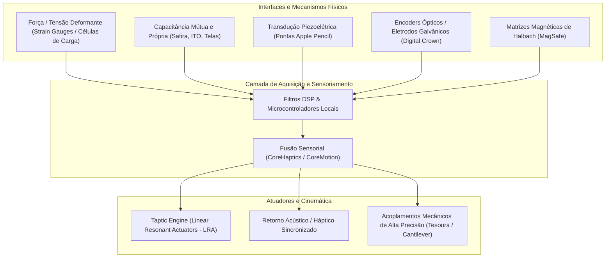
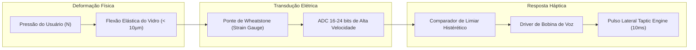

# Tratado de Mecanismos Físicos e Engenharia de Hardware Apple

Este documento fornece uma análise exaustiva e multidisciplinar dos princípios físicos, cinemáticos, microeletromecânicos (MEMS), eletromagnéticos e de ciência dos materiais que fundamentam o ecossistema de hardware e periféricos da Apple.

---

## Sumário Executivo

A filosofia de hardware da Apple baseia-se na convergência entre **sensoriamento de alta resolução**, **ilusão cinestésica tátil** e **tolerâncias mecânicas sub-micrométricas**. Ao substituir mecanismos mecânicos puramente passivos por sistemas eletromecânicos de malha fechada, os dispositivos simulam respostas físicas enquanto aumentam a durabilidade estrutural, hermeticidade e densidade de componentes.



---

## 1. Atuadores Hápticos e Transdução Eletromecânica (Taptic Engine)

### 1.1 Princípio de Operação: Linear Resonant Actuator (LRA) vs Motores Excéntricos (ERM)
Tradicionalmente, dispositivos utilizavam motores com massa excêntrica rotativa (ERM - *Eccentric Rotating Mass*). Os ERMs possuem tempos de subida (*rise time*) lentos (\(>50\text{ ms}\)), frenagem passiva e frequência intrinsecamente acoplada à amplitude da vibração.

A Apple padronizou o **Taptic Engine**, baseado em **Atuadores Ressonantes Lineares (LRA)** de múltiplos eixos customizados:
- **Estrutura Interna**: Uma massa de prova de alta densidade (geralmente liga sinterizada de tungstênio) suspensa no interior de uma carcaça hermética de alumínio por **molas de lâmina plana de berílio-cobre (BeCu)** ou silício temperado.
- **Acionamento**: Cercada por bobinas de voz (*voice coils*) de cobre sem oxigênio e ímãs permanentes de neodímio-ferro-boro (NdFeB).
- **Equação Dinâmica do Oscilador**:
  \[
  m \ddot{x}(t) + c \dot{x}(t) + k x(t) = F_{\text{Lorentz}}(t) = B \cdot L \cdot I(t)
  \]
  Onde:
  - \(m\): Massa do oscilador de tungstênio.
  - \(c\): Coeficiente de amortecimento viscoso interno.
  - \(k\): Constante elástica das molas de suspensão de lâmina.
  - \(B\): Densidade do fluxo magnético no entreferro.
  - \(L\): Comprimento efetivo do condutor na bobina de voz.
  - \(I(t)\): Corrente controlada por sinal PWM/analógico via DAC dedicado.

### 1.2 Frenagem Eletromagnética Ativa (*Active Braking*)
Para simular a rigidez estática de um clique de interruptor mecânico (duração de apenas \(5\text{ a }15\text{ ms}\)), o Taptic Engine não permite que a massa oscile livremente após a excitação:
1. O controlador injeta uma onda de pulso de aceleração inicial positiva.
2. Imediatamente após a deflexão de pico, injeta um pulso de polaridade inversa de 180° de defasamento (*anti-phase braking current*), neutralizando a energia cinética residual da massa quase instantaneamente.
3. O efeito cinestésico resultante atinge os mecanorreceptores cutâneos humanos (especialmente os corpúsculos de Pacini, sensíveis a vibrações de \(150\text{ a }300\text{ Hz}\)), enganando o córtex somatossensorial para que perceba uma deflexão mecânica real onde existe apenas deformação transitória.

### 1.3 Implementações Específicas
- **Trackpad Force Touch (MacBook)**: Quatro eletroímãs laterais impulsionam a placa de vidro em uma oscilação puramente paralela/horizontal ao plano do chassi. O cérebro humano interpreta essa aceleração cortante lateral como um afundamento vertical de clique.
- **Botão Home (iPhone 7, 8, SE 2/3)**: Disco rígido de cristal de safira/vidro estático que gera uma onda de pressão acústico-mecânica quando o sensor capacitivo de toque registra contato com pressão.
- **Apple Pencil Pro**: Mini-LRA cilíndrico coaxial com o corpo da caneta, fornecendo feedback de "clique" ou "estalo" diretamente na polpa dos dedos ao pressionar (*squeeze*) ou girar (*barrel roll*).

---

## 2. Sensoriamento de Força e Deformação Estrutural (Force Touch & Strain Gauges)

### 2.1 Células de Carga de Deformação Elástica (MacBook Trackpad)
Sob cada um dos quatro cantos do Trackpad Force Touch, encontram-se sensores de força de lâmina fina integrados com pontes de Wheatstone:
- **Princípio Físico**: Quando o usuário exerce pressão sobre a superfície de vidro, a estrutura de suporte sofre uma micro-deflexão da ordem de micrômetros (\(\mu\text{m}\)).
- Essa deflexão altera a resistência elétrica de medidores de deformação (*strain gauges*) piezorresistivos:
  \[
  \frac{\Delta R}{R} = S_{\varepsilon} \cdot \varepsilon
  \]
  Onde \(S_{\varepsilon}\) é o fator de calibre (*gauge factor*) e \(\varepsilon = \frac{\Delta L}{L}\) é a deformação linear.
- **Detecção Multinível**:
  1. *Light Press / Hover*: Detecção de repouso dos dedos sem deflexão ativa.
  2. *First Click*: Limiar de força padrão (\(\sim 1.0\text{ a }1.4\text{ N}\)).
  3. *Force Click (Deep Press)*: Limiar secundário programável (\(\sim 2.5\text{ a }3.5\text{ N}\)), acionando funções como Quick Look ou definição de palavras.



---

## 3. Botão de Controle de Câmera (Camera Control - iPhone 16 / 16 Pro)

O *Camera Control* representa a união mais avançada de três tecnologias físicas sobrepostas em um módulo de menos de 2 mm de perfil:

```
+-------------------------------------------------------+
|  Cristal de Safira com Revestimento Condutivo e Oleofóbico | <- Superfície tátil e toque capacitivo
+-------------------------------------------------------+
|  Malha de Eletrodos Capacitivos Sub-superficiais      | <- Reconhece deslizamento horizontal (swipe)
+-------------------------------------------------------+
|  Sensor de Força de Alta Sensibilidade (Force Sensor) | <- Detecta meia-pressão / Light Press
+-------------------------------------------------------+
|  Microswitch Mecânico Tátil de Aço Inoxidável (Dome)  | <- Clique físico mecânico real de curso curto
+-------------------------------------------------------+
|  Acoplamento Direto ao Taptic Engine Local            | <- Feedback de clique sintético para meio-toque
+-------------------------------------------------------+
```

### 3.1 Mecânica das Fases de Acionamento:
1. **Fase Capacitiva Multitoque**:
   - A tampa de cristal de safira pura é circundada por um anel de aço inoxidável refinado e conta com uma matriz de eletrodos capacitivos gravados por litografia em sua face interna.
   - Detecta o vetor de velocidade e posição do dedo deslizando com granularidade sub-milimétrica para controle de exposição, zoom óptico e troca de distância focal simulando a coroa mecânica de uma câmera analógica.
2. **Fase Piezorresistiva / Força Leve (*Light Press*)**:
   - Entre a safira e o interruptor de domo existe um transdutor de força de estado sólido.
   - Ao aplicar uma força entre \(0.3\text{ N}\) e \(0.8\text{ N}\), o sensor registra a pré-tensão sem fechar o contato mecânico.
   - O Taptic Engine do iPhone responde instantaneamente com um clique leve (*clicklet*), fornecendo ao usuário a certeza tátil de ter travado foco e exposição (análogo ao obturador bifásico de SLRs).
3. **Fase Mecânica de Domo (*Full Click*)**:
   - Ao superar a força do domo bistável de aço mola (\(\sim 1.8\text{ N}\)), o domo colapsa elasticamente, estabelecendo contato elétrico de baixa resistência e capturando a fotografia instantaneamente.

---

## 4. Ferramentas de Precisão Ativa: Apple Pencil (1ª, 2ª Geração e Pencil Pro)

O Apple Pencil opera como um instrumento cinemático e eletromagnético de alta frequência em perfeita sintonia com a camada de digitalização do iPad.

### 4.1 Transdução de Pressão na Ponta
O bico de polioximetileno condutivo não atua apenas como condutor estático:
- **Transdutor de Força Axial**: A ponta rosqueável pressiona uma haste metálica que descarrega sobre um transdutor piezoelétrico cerâmico ou capacitor de deslocamento variável.
- **Resolução**: Converte força de contato mecânica de \(0\text{ a }4.0\text{ N}\) em 4.096 níveis discretos de pressão com linearidade calibrada em fábrica.
- **Latência de Amostragem**: Amostrado a \(240\text{ Hz}\) (sincronizado com a taxa de atualização e leitura de toque ProMotion de \(120\text{ Hz}\) da tela).

### 4.2 Medição de Inclinação (*Tilt*) e Azimute Espacial
- A caneta contém **dois anéis emissores de radiofrequência / eletrostáticos coaxiais** defasados espacialmente ao longo do eixo da ponta.
- A tela capacitiva do iPad mede a diferença de amplitude e distorção elíptica do campo elétrico gerado por cada emissor.
- Por trigonometria de campo, o processador do iPad decompõe:
  - O ângulo de ataque em relação à normal da tela (\(\theta\), tilt).
  - A projeção azimutal do corpo no plano \(XY\) (\(\phi\), orientação vetorial para sombreamento com grafite virtual).

### 4.3 Giro de Barril (*Barrel Roll*) e Detecção de Compressão (*Squeeze*) - Pencil Pro
- **Giroscópio MEMS Integrado**: Um giroscópio de 3 eixos de baixíssima potência dentro do corpo mede a rotação angular ao redor do eixo longitudinal (\(\omega_z\)), permitindo ao usuário girar pincéis caligráficos ou alterar formatos de pontas em tempo real.
- **Sensores de Deformação de Chassi (*Squeeze*)**: Na área de pega dos dedos, sensores capacitivos/resistivos de flexão detectam a compressão lateral rápida do invólucro termoplástico, acionando a paleta de ferramentas com retorno imediato do micro-Taptic Engine interno da caneta.

### 4.4 Indução Eletromagnética e Fixação Magnética
- **Alinhamento Magnético**: O corpo do Pencil possui ímãs de neodímio em posições milimetricamente espelhadas aos ímãs embutidos na borda lateral de alumínio do iPad, garantindo centralização automática com força de retenção de aproximadamente \(3\text{ a }5\text{ N}\).
- **Bobina de Transferência Indutiva**: Na face plana do Pencil 2 / Pro, uma micro-bobina planar de cobre recebe energia sem fio de uma bobina transmissora no iPad na frequência de \(\sim 100\text{ a }300\text{ kHz}\) (norma proprietária com eficiência otimizada para baterias cilíndricas Li-íon miniaturizadas de \(3.8\text{ V}\)).

---

## 5. Codificação Rotativa e Biometria Físico-Óptica

### 5.1 Digital Crown (Apple Watch, AirPods Max, Vision Pro)
A Digital Crown soluciona o problema de oclusão de telas minúsculas (onde o dedo cobriria o conteúdo ao rolar).

```
        Coroa Externa de Titânio/Aço
                   |
     [Eletrodo Galvânico de Safira/Metal] -> Contato Dérmico (ECG / Lead I)
                   |
          Eixo de Aço Endurecido
                   |
    +--------------+--------------+
    |                             |
    v                             v
[Disco Codificador Óptico]   [Sensor Magnético Hall]
com Fendas Sub-micrométricas  para Detecção de Polo N-S
    |                             |
    +--------------+--------------+
                   |
         Interruptor de Clique Axial
```

- **Codificador Rotativo Óptico (Optical Rotary Encoder)**:
  - O eixo interno acopla-se a um disco codificador com micro-ranhuras gravadas a laser.
  - Um emissor LED infravermelho e um par de fotodiodos em quadratura medem a passagem das fendas. A defasagem de 90° entre os sinais dos dois fotodiodos permite determinar com precisão absoluta tanto o sentido de rotação quanto a velocidade angular.
- **Eletrodo Biométrico de ECG**:
  - A face externa da coroa é isolada do restante do chassi por uma junta de cerâmica e conectada diretamente a um amplificador de biopotencial analógico de alta impedância. Ao tocar a coroa com o dedo indicador da mão oposta enquanto a base traseira toca o pulso, fecha-se o circuito torácico galvânico para captura do eletrocardiograma (Lead I).

### 5.2 Touch ID: Sensoriamento Capacitivo de Radiofrequência
- Localizado sob cristal de safira polido quimicamente (dureza 9 Mohs para evitar arranhões que distorceriam as medições dielétricas).
- **Anel de Ativação Metálico**: Em aço inoxidável ou titânio, detecta o toque do dedo fechando a malha de aterramento e acorda o circuito integrado.
- **Matriz de Silício Ativa**: Emite um sinal de RF na faixa de MHz que penetra a camada córnea superficial morta da pele, mapeando as variações de capacitância na camada dérmica viva subjacente (vales e cristas papilares), imune a sujeiras superficiais.

### 5.3 Face ID e TrueDepth: Óptica Difrativa e VCSEL
- **Flood Illuminator**: Diodo emissor de infravermelho de comprimento de onda de \(940\text{ nm}\) que banha a face em luz invisível ao olho humano.
- **Dot Projector (Projetor de Pontos)**:
  - Laser de Cavidade Vertical de Emissão Superficial (**VCSEL**).
  - Feixe colimado passa por um **Elemento Óptico Difrativo (DOE)** microestruturado que divide o raio laser em uma constelação padronizada de mais de 30.000 pontos infravermelhos.
- **Câmera Infravermelha CMOS**: Captura a distorção trigonométrica da malha de pontos na superfície tridimensional do rosto, reconstruindo a geometria 3D por triangulação óptica independente da iluminação ambiente.

---

## 6. Acoplamentos Magnéticos e Matrizes de Halbach (MagSafe & Smart Connectors)

### 6.1 Matrizes de Halbach (*Halbach Array*) no MagSafe
A fixação magnética em smartphones convencionais enfrenta um paradoxo: ímãs fortes atraem objetos indesejados, descalibram a bússola digital interna (magnetômetro MEMS) e geram correntes de Foucault na carcaça de alumínio.

A Apple solucionou isso implementando um **arranjo de Halbach circular**:

```
Fluxo Magnético Concentrado na Face Frontal (Atração Máxima)
  ▲   ▲   ▲   ▲   ▲   ▲   ▲   ▲   ▲   ▲
┌───┬───┬───┬───┬───┬───┬───┬───┬───┬───┐
│ → │ ↑ │ ← │ ↓ │ → │ ↑ │ ← │ ↓ │ → │ ↑ │  <- Orientação dos Vetores de Magnetização
└───┴───┴───┴───┴───┴───┴───┴───┴───┴───┘
  |   |   |   |   |   |   |   |   |   |
  x   x   x   x   x   x   x   x   x   x
Fluxo Quase Nulo na Face Traseira (Interior do iPhone / Blindagem)
```

- **Propriedade Matemática**: Ao rotacionar a direção da magnetização dos blocos em 90° sequencialmente, as componentes de campo magnético cancelam-se mutuamente em uma das faces e somam-se construtivamente na face oposta.
- **Resultado Prático**: A força de atração mecânica é quase dobrada na superfície externa onde o acessório se conecta, enquanto o campo de dispersão interna (\(B_{\text{interior}}\)) permanece na faixa de microteslas (\(\mu\text{T}\)), sem saturar o sensor geomagnético nem interferir no estabilizador óptico de imagem (OIS) da câmera.

### 6.2 Smart Connector e Pinos Pogo
- **Contatos Pogo com Mola**: Três ou quatro pinos retráteis de cobre-berílio usinado com mola interna de aço inox, recebendo banho de ouro galvânico de alta pureza (\(>1\mu\text{m}\)) para resistência à corrosão e baixa resistência de contato (\(<20\text{ m}\Omega\)).
- **Comunicação e Alimentação**: O conector transporta simultaneamente energia elétrica contínua (\(V_{\text{bus}}\)), linha de aterramento e canal serial bidirecional multiplexado de dados para acessórios como o iPad Smart / Magic Keyboard, eliminando pareamento Bluetooth e baterias no periférico.

---

## 7. Cinemática de Teclados e Dobradiças Articuladas

### 7.1 Mecanismo de Tesoura (*Scissor Switch*) Reformulado
Após a transição e descontinuação do mecanismo de borboleta (*butterfly mechanism*), a Apple refinou o interruptor de tesoura:
- **Cinemática**: Dois braços de plástico de engenharia de alta densidade (polioximetileno - POM) que se cruzam em formato de "X", acoplados por pivôs de encaixe elástico.
- **Estabilidade Contra Tombamento (*Anti-wobble*)**: Garante que o afundamento da tecla ocorra estritamente na vertical com deflexão angular nula, mesmo quando a força é exercida no canto extremo da barra de espaço ou tecla Shift.
- **Domo de Retorno de Silicone Elastômero**: Projetado com curva de força-deslocamento (*force-displacement curve*) de pico acentuado (\(\approx 65\text{ g}\)) e curso linear de \(1.0\text{ mm}\), garantindo histerese tátil nítida.

### 7.2 Dobradiça de Fricção Balanceada do MacBook (*One-Finger Open*)
A clássica abertura do MacBook com apenas um dedo sem que a base se levante é resultado de cálculo estático rigoroso:
- **Mecanismo de Embreagem de Mola Axial**: Cilindros de fricção concêntricos em aço inoxidável sinterizado com graxa fluorada sintética de viscosidade estável em temperatura ambiente.
- **Equilíbrio de Momentos de Torque**:
  \[
  \tau_{\text{fricção}}(\theta) < m_{\text{base}} \cdot g \cdot d_{\text{CG}}
  \]
  O torque de atrito estático da dobradiça (\(\tau_{\text{fricção}}\)) é calibrado para ser sempre estritamente inferior ao momento restaurador de gravidade gerado pela massa da base de alumínio e baterias em relação ao eixo da dobradiça, permitindo movimento contínuo sem solavancos.

### 7.3 Dobradiça Cantilever Flutuante (Magic Keyboard para iPad)
- **Cinemática Bi-articulada**: Dois eixos cilíndricos paralelos usinados em alumínio forjado.
- O primeiro eixo abre a tampa e forma a base de apoio triangular; o segundo eixo inclina o iPad magneticamente suspenso em um ângulo suave (\(90^\circ\text{ a }130^\circ\)), mantendo o centro de gravidade total projetado com segurança dentro do polígono de sustentação da base do teclado para evitar tombamento.

---

## 8. Sistemas Microeletromecânicos (MEMS) e Sensores Ambientais

### 8.1 Acelerômetro e Giroscópio MEMS
- **Acelerômetro**: Massa sísmica micrométrica de silício gravada por corrosão iônica reativa profunda (DRIE), suspensa por vigas elásticas. Nas laterais da massa, existem pentes de placas capacitivas interdigitadas. A aceleração desloca a massa, alterando a capacitância diferencial:
  \[
  \Delta C = C_1 - C_2 = 2 \varepsilon_0 A \frac{\Delta x}{d^2 - \Delta x^2} \propto a_{\text{externa}}
  \]
- **Giroscópio**: Baseia-se no **efeito Coriolis**. A massa oscila continuamente em um eixo acionada por eletrostática. Ao girar o dispositivo com velocidade angular \(\vec{\Omega}\), a força de Coriolis \(F_C = 2 m (\vec{v} \times \vec{\Omega})\) deflete a massa em um eixo ortogonal, onde outro conjunto de pentes capacitivos quantifica a rotação.

### 8.2 Barômetro e Sensor de Pressão Piezorresistivo
- Membrana de silício ultrafina hermeticamente selada sobre uma cavidade de vácuo de referência.
- A deformação provocada pela pressão atmosférica altera a condutividade através do efeito piezorresistivo, detectando variações de altitude de poucos centímetros e suportando a detecção de queda e contagem de lances de escada.

### 8.3 LiDAR Scanner (dToF - Direct Time-of-Flight)
Diferente de sensores baseados em luz estruturada ou ToF indireto de fase (iToF), o LiDAR da Apple emprega **Time-of-Flight Direto**:
- Um emissor VCSEL emite pulsos de luz laser infravermelha com durações na escala de picossegundos.
- Os fótons refletidos são detectados por uma matriz de **Diodos de Avalanche de Fóton Único (SPAD - *Single-Photon Avalanche Diodes*)**.
- A distância é calculada diretamente pelo tempo de trânsito dos fótons na velocidade da luz (\(d = \frac{c \cdot \Delta t}{2}\)), com precisão milimétrica até 5 metros de distância, independente das texturas superficiais ou iluminação do ambiente.

---

## 9. Ciência dos Materiais e Termodinâmica de Dissipação

### 9.1 Chassis e Metalurgia Estrutural
- **Alumínio Série 7000 (Zinco-Magnésio)**: Empregado a partir do iPhone 6s para resistir a deformações plásticas permanentes sob flexão, com resistência ao escoamento superior a \(400\text{ MPa}\).
- **Titânio Grau 5 (Ti-6Al-4V)**: Utilizado no iPhone 15 Pro / 16 Pro e Apple Watch Ultra, unido termomecanicamente por **soldagem por difusão em estado sólido** a um núcleo estrutural de alumínio usinado. Essa técnica combina a dureza superficial e resistência à corrosão do titânio com a elevada condutividade térmica e baixo peso do alumínio.
- **Ceramic Shield**: Matriz vítrea incorporada com nanocristais de cerâmica cultivados por tratamento térmico controlado de nucleação, gerando reflexão e dispersão de microfissuras que aumentam a tenacidade à fratura em até 4 vezes comparado a vidros temperados comuns de aluminossilicato.

### 9.2 Câmaras de Vapor e Tubos de Calor Bifásicos
Em MacBooks e iPads de alta performance, a densidade de potência térmica (\(\text{W/cm}^2\)) nos nós de silício de 3nm exige dissipação bifásica:
- **Câmara de Cobre Selada a Vácuo**: Contém água desoxigenada ultrapura em pressão sub-atmosférica.
- O calor do SoC evapora o fluido instantaneamente no evaporador; o vapor viaja em alta velocidade para o condensador, onde transfere calor para as aletas de alumínio.
- Uma estrutura capilar sinterizada de pó de cobre (*sintered wick structure*) bombeia o fluido condensado de volta para a fonte de calor por ação capilar, sem peças móveis.

### 9.3 Ventiladores com Espaçamento Assimétrico de Pás (*Aeroacústica*)
As ventoinhas centrífugas dos MacBooks Pro não possuem pás uniformemente espaçadas:
- O espaçamento angular segue uma sequência pseudorrandômica calculada.
- **Objetivo Físico**: Ventiladores de pás simétricas concentram a energia acústica em uma única frequência fundamental (\(f = N_{\text{pás}} \times \text{RPM}\)) e seus harmônicos agudos, gerando um zumbido tonal irritante. O espaçamento assimétrico distribui a energia sonora por uma banda contínua de ruído branco, tornando a operação do ventilador imperceptível ao ouvido humano mesmo sob fluxo de ar turbulento.

---

## 10. Matriz Comparativa de Mecanismos e APIs de Software

A tabela a seguir correlaciona os mecanismos físicos às suas respectivas tecnologias de sensoriamento, atuadores e frameworks do ecossistema Apple:

| Mecanismo Físico | Fenômeno / Transdutor Físico | Hardware / Dispositivos | API de Sistema / Framework |
| :--- | :--- | :--- | :--- |
| **Trackpad Click** | Strain gauges + LRA Eletromagnético | MacBook, Magic Trackpad | `AppKit / NSEvent`, `CoreHaptics` |
| **Camera Control** | Safira capacitiva + Sensor de Força + Dome | iPhone 16 / 16 Pro | `AVFoundation (AVCaptureDevice)`, UIControl |
| **Pencil Squeeze/Roll** | MEMS Gyro + Eletrostática + Micro-LRA | Apple Pencil Pro, iPad M4 | `PencilKit (PKToolPicker)`, `UIGestureRecognizer` |
| **Digital Crown** | Codificador Óptico em Quadratura + ECG | Apple Watch, AirPods Max, Vision Pro | `WatchKit (WKInterfaceCrownSequencer)`, `HealthKit` |
| **Spatial Tracking** | SPAD dToF LiDAR + VCSEL Dot Projector | iPhone Pro, iPad Pro, Vision Pro | `ARKit`, `SceneKit`, `RealityKit` |
| **Inércia e Movimento** | Pentes capacitivos diferenciais MEMS | Todos os dispositivos iOS/watchOS/visionOS | `CoreMotion (CMMotionManager)` |
| **MagSafe Auth** | Matriz de Halbach + Detecção Hall + NFC | iPhone 12+, MagSafe Chargers | `ExternalAccessory`, `CoreNFC` |

---

## Conclusão e Diretrizes de Engenharia

O diferencial de hardware da Apple repousa no casamento indissociável entre **física dos materiais**, **cinemática de precisão** e **sensoriamento digital em malha fechada**. Ao projetar soluções que interagem com esses sistemas físicos:
1. Respeite os limiares de histerese e latência física dos sensores.
2. Utilize feedback háptico com tempos de pulso restritos a dezenas de milissegundos para evitar fadiga perceptiva e dessincronização cinestésica.
3. Aproveite os canais de alta resolução (tais como amostragem de \(240\text{ Hz}\) da camada capacitiva e sensores de pressão analógicos) para proporcionar interfaces contínuas e sem ruídos de quantização.
